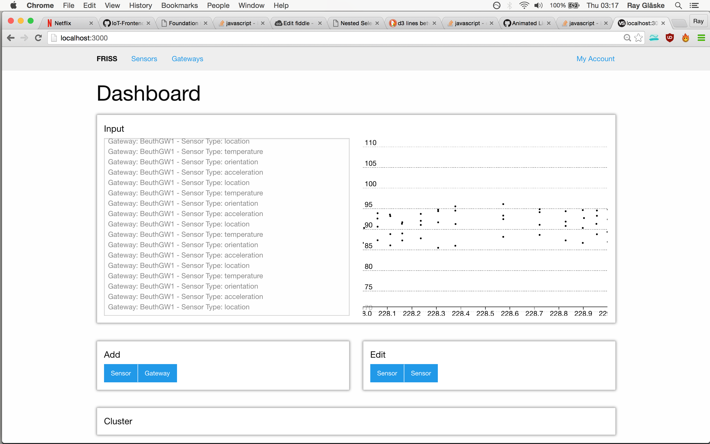
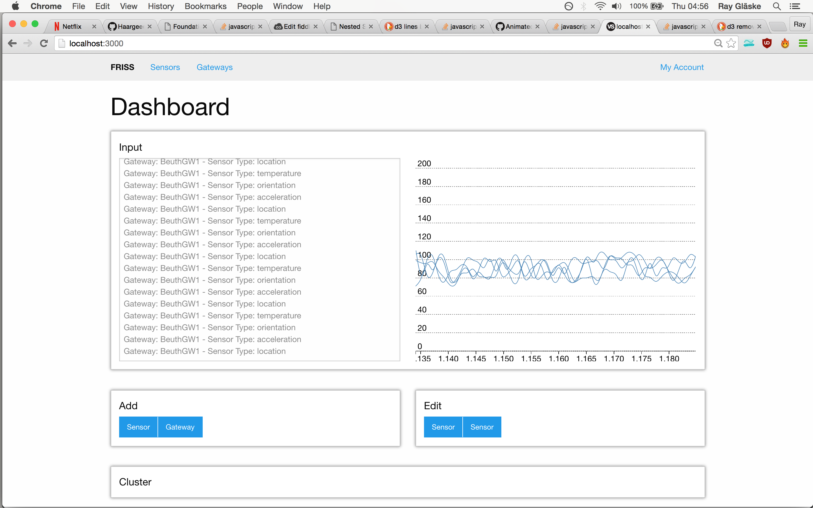

# IoT-Frontend
See all the data

## Installation

You need:
  * node (at least version 4.\*)
  * dynamoDB

installed on your computer.

### node

MAC via homebrew

```
brew install node
```

Linux. I'm just guessing now but:

```
apt-get install nodejs
apt-get install npm
```

Maybe you have to `sudo` it. I don't know.

Windows.

I guess going to the website, download a .exe and doubleclick it.

Just in case: http://blog.teamtreehouse.com/install-node-js-npm-windows

### dynamodb

Download the jar file from here:

http://docs.aws.amazon.com/amazondynamodb/latest/gettingstartedguide/GettingStarted.JsShell.html

Run the database locally with:

```
java -Djava.library.path=./DynamoDBLocal_lib -jar DynamoDBLocal.jar -sharedDb
```

Apparently you need a AWS account for that. No problem you think it's free.
Well, they still ask you for a credit card. For many people that's a no-go.

You need to make a `~/.aws/credentials` file which looks like this:
Oh wait! Hey windows users. You need to put it here `%USERPROFILE%\.aws\credentials`:

```
[default]
aws_access_key_id = YOUR_ACCESS_KEY_ID
aws_secret_access_key = YOUR_SECRET_ACCESS_KEY
```

All set? Good. So on `git clone` this repo.

Make sure to install all important dependencies.

```
npm install
```

You actually have to install `gulp` globally. So run:

```
npm install gulp -g
```

OK. You are almost done. We (I) are using gulp for building our files. So run:

```
gulp
```

Now you can run the server with 

```
node .
```

Here you could be super cool and install `node-dev` and run it.
The server restarts everytime when you save a file.

```
npm install node-dev -g
```

And then run it with:

```
node-dev .
```

In your browser you can visit now `localhost:3000` to see our nice project in action.

## Preview

I still learning the d3.js functionality. It's almost Rocket Science!

Here is a newer Screenshot:





