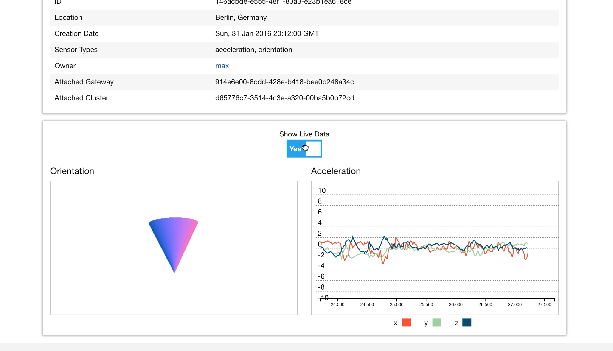

# IoT-Frontend
See all the data

## Installation

You need a node version at least 4.\* installed on your computer.

### node

MacOS: via homebrew

```
brew install node
```

Linux: I'm just guessing now but:

```
sudo apt-get install nodejs
sudo apt-get install npm
```

Windows:

I guess going to the website, download a .exe and doubleclick it.

Just in case: http://blog.teamtreehouse.com/install-node-js-npm-windows

### dynamodb

In `config/` is an example aws config file. There you can save a config file for production with your credentials. It has to be in this file `config/aws_config.json`

All set? Good. So on `git clone` this repo.

Make sure to install all important dependencies.

```
npm install
```

You actually have to install `gulp` globally. So run:

```
npm install gulp -g
```

OK. You are almost done. We (I) are using gulp for building our files. So run:

```
gulp
```
This command starts process which is always listening for changes and you have to open a new terminal window to proceed. If you don't like this you also could run:

```
gulp production
```

Now you can run the server with

```
node .
```

Here you could be super cool and install `node-dev` and run it.
The server restarts everytime when you save a file.

```
npm install node-dev -g
```

And then run it with:

```
node-dev .
```

In your browser you can visit now `localhost:3000` to see our nice project in action.

## Preview

Here is a small preview for the live data from a single sensor.


